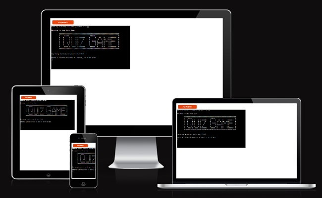
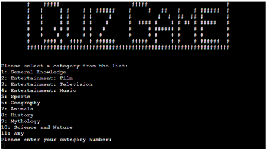
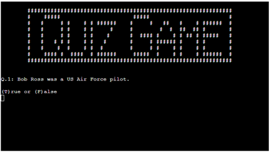
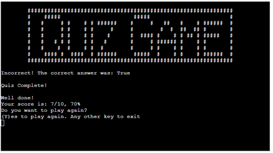
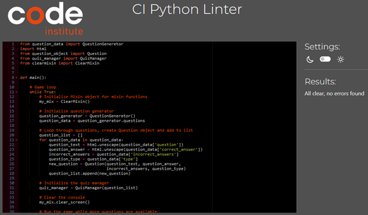

# The Quiz Game

The Quiz Game is a Python terminal game, which runs in a mock terminal on Heroku.

Users can test their knowledge on a range of subjects, with varying difficulty.

[Play the live version of the project on Heroku](https://quiz-game-9ac41298d590.herokuapp.com/)

## How to play
In this version of The Quiz Game, the user is prompted to answer some configuration questions which drive the selection of questions, categories etc.

Once the questions are answered, the application will generate a series of questions which are presented to the user to answer.

The answers to the questions are entered with either be "T" or "F" for True/False questions or an integer ranging from 1 to 4 for multiple choice questions.

Once the quiz is complete the user is presented with their score of correct answers out of the total number of questions along with a percentage of correct answers.

## Features

### Game Workflow

[Process flows for the game](documentation/workflow/quiz-game-workflow.pdf)

### Existing Features

- Question configuration
    - The user is prompted to provide answers to the following configuration questions:
        - Number of questions for the game ranging from 10 to 40

        

        - Specific category of questions or multiple categories

        

        - Specific difficulty of questions or multiple difficulties

        

        - Type of questions, True/False or Multiple Choice 

        
        
    - Once the configuration questions have been answered, questions are retrieved via API from the [Open Trivia Database](https://opentdb.com/) and the game will proceed to ask the questions one by one.
        
        - True/False Question Example:  
        
        
        
        - Multiple Choice Question Example:
        
        
    
    - Once all questions have been answered, the user is presented with their score of correct answers out of 
    the total number of questions as well a correct percentage.
    
    - The user is also offered an opportunity to start the Quiz Game again and continue playing or to quit the game
    
    
    
    - All data is maintained in class instances
    
### Future Features
    - Allow for additional question categories to be selected
    - Enable more than one person/team to compete in the Quiz Game
    - Enable questions that require typed answers
    - Enable selection of multiple question types per game

## Data Model

I decided to use a series of classes, each class is responsible for a different aspect of the game.
The following classes were implemented which are detailed below:
- Question
- Question Generator
- Quiz Manager
- Clear Mixin

### Question Class

The Question class is responsible for storing various attributes for each of the questions.
The attributes handled by this class are as follows:
- Question text
- Correct answer to the question
- A list of incorrect answers
- The type of question

### Question Generator Class

- The Question Generator class is responsible for getting answers to the configuration questions.
- With these responses, this class uses an API call to obtain questions from the Open Trivia Database.
- In the event that no questions are returned based on the difficulty level, a second API call is used to fetch questions for any difficulty level.

### Quiz Manager Class

- The Quiz Manager class is responsible for running the game until no questions remain
- The class handles the following elements of the game:
    - Asking of the questions
    - Reading and validating the answer input
    - Verifying if the answer is correct
    - Storing and updating the user score
    - Computing the total score and correct answer percentage once the quiz completes
     
### Clear Mixin Class

The Clear Mixin class contains shared functions as follows:
- Display the ASCII Art logo
- Clear screen function which clears the terminal display using the correct operating system command based on the operating system the terminal application is running on.

## Testing

### Bugs

#### Solved Bugs
- The length of the category list was initially hard-coded which caused issues when adding additional categories.
    - The category length was updated to be dynamically calculated during the running of the game
- Questions with special characters were formatted incorrectly.
    - Introduced the html unescape function to convert special characters to plain text
- Blank answers that were submitted created validation problems.
    - Updated validation to ensure no blank answers are submitted
- Where questions do not exist for a category and difficulty combination, the game could not run
    - Changed the code to verify that an empty question object is not received from the API, when this is the case, a second API call is completed with a random "any" difficulty selected
- The API only allows for 1 call every 5 seconds.
    - When calling the API for a second time, a 5 second delay was added to ensure the API call is not rejected
- Selecting a value outside of the multiple choice answer list causes the correct answer to be added to the list and displayed again.
    - Added verification to the answer list to ensure the correct answer is not appended again.
- An ASCII art logo containing backslash characters generated code linter warnings
    - Selected a different ASCII art logo to avoid linter issues

#### Remaining Bugs
- There are no remaining bugs in the application

### Validator Testing

All code has been validated using the [Code Institute PEP8 validator](https://pep8ci.herokuapp.com/)

- run.py validation

- question_data.py validation

- question_object.py validation

- quiz_manager.py validation

- clearmixin.py validation

## Deployment & Local Development

### Local Development
#### How to clone the repository
To Clone the Quiz Game repository:

1. Log in to Github
2. Got to the repository for this application, jayleighton/quiz-game
3. Click on the Code button at the top right of the screen and select HTTPS, SSH, or GitHub CLI
4. Copy the link
5. Open the terminal on your code editor in the directory where the project needs to be cloned
6. Enter `git clone` into the terminal and paste the Github link
7. Press enter to clone the repository

#### How to fork the repository
To fork the Quiz Game Repository:

1. Log in to Github
2. Go to the repository for this project, jayleighton/quiz-game
3. Select Fork at the top of the screen

### How to deploy the game

#### Reminders

- Your code must be placed in the following files:
    - `run.py`
    - `quiz_manager.py`
    - `question_object.py`
    - `question_data.py`
    - `clearmixin.py`
- Your dependencies must be placed in the `requirements.txt` file
- Do not edit any of the other files or your code may not deploy properly

#### Creating the Heroku app

When you create the app, you will need to add two buildpacks from the _Settings_ tab. The ordering is as follows:

1. `heroku/python`
2. `heroku/nodejs`

You must then create a _Config Var_ called `PORT`. Set this to `8000`

Connect your GitHub repository and deploy as normal.

#### Constraints

The deployment terminal is set to 80 columns by 24 rows. That means that each line of text needs to be 80 characters or less otherwise it will be wrapped onto a second line.

## Credits

### Code Credits

- Code Institute
    - Mock terminal code on Heroku
- [Patprjk ASCII ART Generator](https://patorjk.com/software/taag/#p=display&f=Graffiti&t=Type%20Something%20)
    - ASCII Art generation

