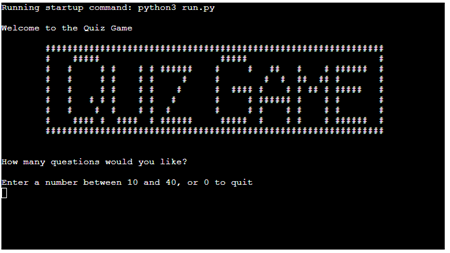
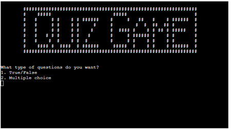

# The Quiz Game

The Quiz Game is a Python terminal game, which runs is a mock terminal on Heroku.

Users can test their knowledge on a range of subjects of varying difficulty.

[The live version of the project is available here](https://quiz-game-9ac41298d590.herokuapp.com/)

## How to play
In this version of The Quiz Game, the user is prompted to answer some configuration questions.

Once the questions are answered, the application will generate a series of questions which are presented to the user to answer.

The answers to the questions with either be T or F for True/False questions or an integer ranging from 1 to 4 for multiple choice questions.

Once the quiz is complete the user is presented with their score of correct answers out of the total number of questions.

## Features

### Existing Features

- Question configuration
    - The user is prompted to provide answers to the following configuration questions:
        - Number of questions for the game
        
        - Specific category of questions or any category
        
        - Difficulty or questions
        
        - Type of questions 
        
    - Once the configuration questions have been answered, questions are retrieved via API from the [Open Trivia Database](https://opentdb.com/) and the game will proceed to ask the questions one by one.
    - Once all questions have been answered, the user is presented with their score of correct answers out of 
    the total number of questions as well a correct percentage.
    - The user is also offered an opportunity to start the Quiz Game again and continue playing or to quit the game
    

    
### Future Features

## Data Model

## Testing

### Bugs

#### Solved Bugs

#### Remaining Bugs

### Validator Testing

## Deployment

### Local Development

#### How to clone the repository

#### How to fork the repository

### How to deploy the game

#### Reminders

- Your code must be placed in the `run.py` file
- Your dependencies must be placed in the `requirements.txt` file
- Do not edit any of the other files or your code may not deploy properly

#### Creating the Heroku app

When you create the app, you will need to add two buildpacks from the _Settings_ tab. The ordering is as follows:

1. `heroku/python`
2. `heroku/nodejs`

You must then create a _Config Var_ called `PORT`. Set this to `8000`

If you have credentials, such as in the Love Sandwiches project, you must create another _Config Var_ called `CREDS` and paste the JSON into the value field.

Connect your GitHub repository and deploy as normal.

#### Constraints

The deployment terminal is set to 80 columns by 24 rows. That means that each line of text needs to be 80 characters or less otherwise it will be wrapped onto a second line.

---

Happy coding!
